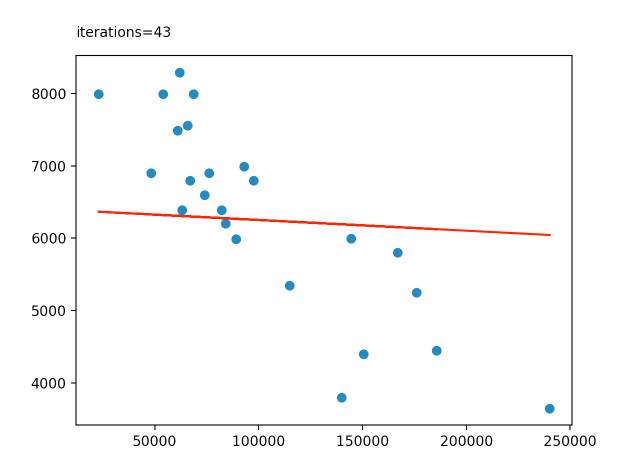

# ft_linear_regression
A simple linear regression model using gradient descent. Data is first normalized, then parameters are calculated and stored.



## Requirements
* Numpy
* Pandas
* Matplotlib

## Setup
`pip install -r requirements.txt`

## Usage
```
usage: ft_linear_regression.py [-h] [-t] [-p] [-a] input

Simple linear regression model

positional arguments:
  input

optional arguments:
  -h, --help     show this help message and exit
  -t, --train
  -p, --plot
  -a, --animate
  ```

  First train with input data. A model with parameters will be saved.
  After training an input number can be specified as an argument and a model output will be printed.
